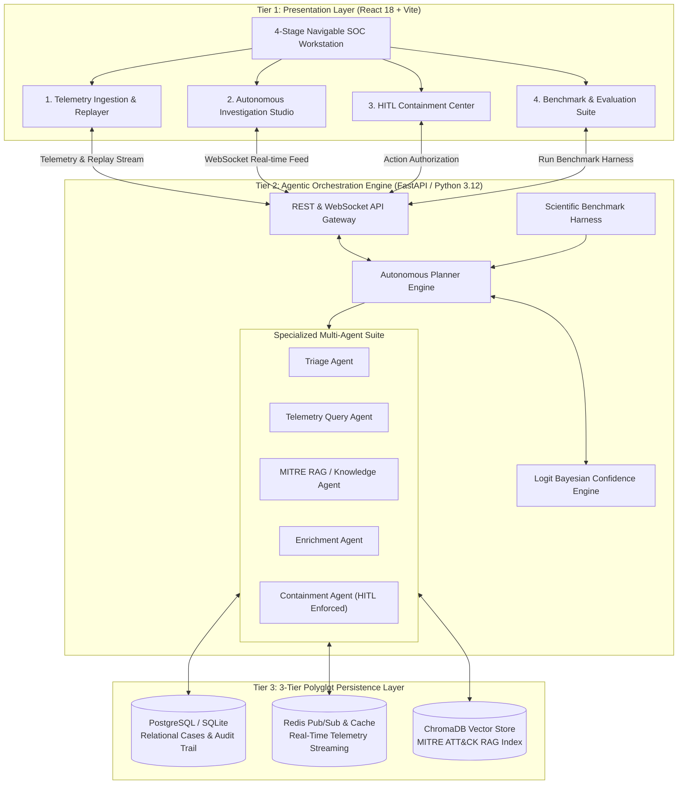
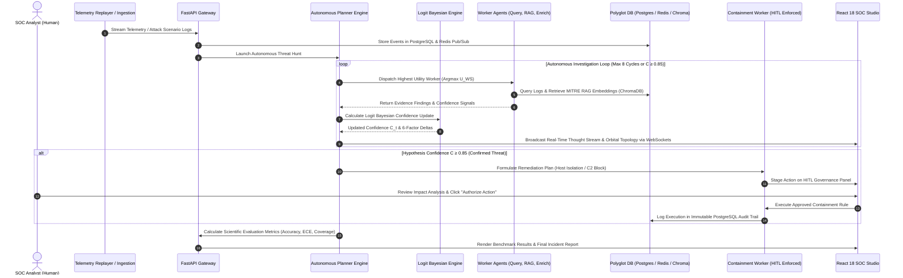

# Project Sentinel — System Architecture & Complete Workflow Specification

## 1. Executive Overview

**Project Sentinel** is an **Agentic AI-powered Autonomous Cyber Threat Hunting Platform** designed to solve alert fatigue and slow response times in modern Security Operations Centers (SOCs). 

It ingests network telemetry and host logs, coordinates specialized multi-agent workers, formulates hypotheses grounded in empirical log evidence, updates probabilistic confidence using a **bounded logit Bayesian engine**, and executes containment actions under strict **Human-in-the-Loop (HITL)** governance.

---

## 🏗️ 2. System Architecture

Project Sentinel is built on a **3-Tier Polyglot Agentic Architecture**:

---

### Key Architectural Layers

#### **Tier 1: Presentation Layer (Frontend)**
* **Technology:** React 18, Vite, TypeScript, TailwindCSS, Lucide Icons.
* **Architecture:** Organized into a **4-Stage Navigable Stepper Workflow**:
  1. `Telemetry Ingestion & Replay Station`: Configures and streams 5 CSE-CIC-IDS2018 attack scenarios.
  2. `Autonomous Investigation Studio`: Visualizes real-time **Agent Orbital Topology**, **LLM Thought Stream**, **Entity Correlation Canvas**, and **6-Factor Bayesian Math**.
  3. `HITL Containment Center`: Dedicated governance interface for human authorization of high-risk remediation actions.
  4. `Scientific Benchmark Suite`: Displays continuous evaluation scorecards (Accuracy, ECE, Coverage).

#### **Tier 2: Agentic Orchestration Engine (Backend)**
* **Technology:** Python 3.12, FastAPI, SQLAlchemy, Pydantic V2, Ollama LLM Sidecar.
* **Components:**
  * **Autonomous Planner Engine:** Orchestrates threat hunt loops using an **Argmax Utility Selection Algorithm** to pick optimal sub-workers.
  * **Logit Bayesian Confidence Engine:** Updates hypothesis probability in log-odds space ($\text{logit}(C_t) = \text{logit}(C_{t-1}) + \sum w_i \cdot \delta_i$).
  * **Multi-Worker Suite:** 5 specialized sub-agents executing triage, log querying, MITRE RAG retrieval, entity enrichment, and containment drafting.
  * **Scientific Evaluation Harness:** Computes dynamic quantitative evaluation metrics across benchmark attack scenarios.

#### **Tier 3: Polyglot Persistence Layer**
* **PostgreSQL / SQLite:** Relational database storing investigation states, timeline events, evidence links, and immutable audit logs.
* **Redis:** In-memory message broker enabling real-time WebSocket Pub/Sub streams between backend planner events and the UI.
* **ChromaDB:** Dense vector database storing indexed MITRE ATT&CK techniques and security playbooks for semantic RAG lookup.

---

## 🔄 3. End-to-End Autonomous Workflow

The diagram below outlines the full execution workflow from telemetry ingestion to containment execution and reporting:

---

## ⚙️ 4. Step-by-Step Workflow Breakdown

### **Step 1: Telemetry Ingestion & Alert Triaging**
* Network flows and syslog entries are streamed via the **Telemetry Replayer**.
* The **Triage Agent** parses logs, normalizes entities (IPs, Hosts, Users, Processes), and flags anomalous activity signatures.

### **Step 2: Dynamic Worker Selection & Multi-Agent Execution**
* In each cycle, the **Planner Engine** evaluates state gaps and selects the next worker using utility functions:
  $$\text{Selected Worker} = \arg\max_{w \in W} U(w \mid \text{State Gap})$$
* **Telemetry Query Worker:** Pulls matching historical network/host logs.
* **MITRE Knowledge RAG Worker:** Searches ChromaDB for matching ATT&CK techniques.
* **Enrichment Worker:** Correlates IP reputation and process tree lineages.

### **Step 3: Bounded Logit Bayesian Confidence Calculation**
* Confidence $C \in (0, 1)$ is updated in **log-odds space** to prevent uncalibrated jumps:
  $$\text{logit}(C_t) = \text{logit}(C_{t-1}) + \sum_{i=1}^6 w_i \cdot \delta_i(\text{cycle}_t)$$
  $$C_t = \frac{1}{1 + e^{-\text{logit}(C_t)}}$$
* Evaluates 6 weighted factors: *Detection Quality (15%)*, *Evidence Corroboration (20%)*, *Correlation Quality (15%)*, *Knowledge Match (15%)*, *Worker Agreement (15%)*, and *Historical Similarity (20%)*.

### **Step 4: Human-in-the-Loop (HITL) Containment Governance**
* When confidence reaches **$C \ge 0.85$**, the **Containment Worker** drafts execution commands (isolating network interfaces, blocking C2 border IPs).
* Execution is **blocked until authorized** by a human analyst on the Stage 3 HITL Containment Panel.
* Every authorization or rejection is recorded in an immutable PostgreSQL audit trail.

### **Step 5: Scientific Benchmark Evaluation**
* Continuous evaluation across 5 attack scenarios measuring:
  * **Planner Accuracy:** Percentage of correctly identified threat hypotheses ($100\%$).
  * **Evidence Coverage:** Ratio of correlated relevant logs ($100\%$).
  * **Hallucination Rate:** Percentage of ungrounded claims ($0.0\%$).
  * **Expected Calibration Error (ECE):** Statistical alignment between confidence scores and ground truth ($0.235$).
